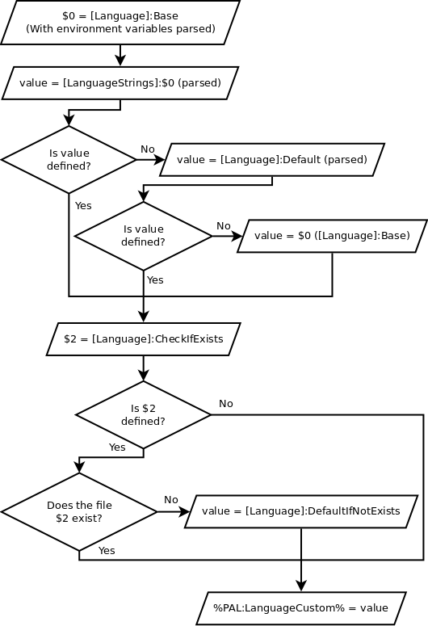

.. index:: Languages, Making things portable; multi-lingual applications

.. _languages:

Languages
=========

The PortableApps.com Launcher supports automatic language switching of
applications when launched from the PortableApps.com Platform, by a series of
environment variables. This document discusses how to go about getting language
setting working for your application, and some quirks of the system.

The environment variables
-------------------------

:ref:`ref-envsub-language` covers the default variables which are available. If
those environment variables are enough for use in a :ini-section:`[FileWriteN]`
section, then you shouldn't need to go beyond here.

.. _languages-custom:

Setting a custom language environment variable
----------------------------------------------

Constructing a custom language environment variable is done with the
:ini-section:`[Language]` and :ini-section:`[LanguageStrings]` sections, and
the final result is placed in :env:`%PAL:LanguageCustom% <PAL:LanguageCustom>`.
Here is the order in which things happen.

1. :ini-key:`[Language]:Base` is read and environment variables are parsed
   (this will normally be other :ref:`language variables
   <ref-envsub-language>`).

2. The key defined by that value is looked up in the section
   :ini-section:`[LanguageStrings]` (into a variable we'll call ``value``).
   
3. If that key did not exist (and so ``value`` is undefined), then
   :ini-key:`[Language]:Default` is read (with environment variable parsing)
   into ``value`` if it exists; if it doesn't exist then
   :ini-key:`[Language]:Base` (with environment variables parsed; the value we
   looked up in :ini-section:`[LanguageStrings]` before) is used.

4. ``%PAL:LanguageCustom%`` is set to ``value``.

5. Now we come to checking if a file exists. This is handy when you have a
   whole table of, for example, glibc-compliant names, but not all possible
   files are there and if an invalid language is specified the application will
   cause problems. It becomes convenient to check if a certain file exists, and
   if it doesn't, reverting to a default value.

6. If :ini-key:`[Language]:CheckIfExists` is not set, the final value is
   ``value`` (and this process stops).  Otherwise, it is read and environment
   variables are parsed.

7. That file is checked for existence: for example, you could have a value of
   ``%PAL:AppDir%\AppName\locales\%PAL:LanguageCustom%.mo``. You should have
   ``%PAL:LanguageCustom%`` at least once in this value (otherwise there
   wouldn't seem much point in it).

8. If this file does not exist, then :ini-key:`[Language]:DefaultIfNotExists`
   is read, environment variables parsed in it, and set as the value for
   ``%PAL:LanguageCustom%``.

**Note:** normally you will want to use only one of
:ini-key:`[Language]:Default` and :ini-key:`[Language]:DefaultIfNotExists`.

Here is a diagram of how it works:

When the portable application is not launched from the PortableApps.com
Platform, to maintain the user's language setting, the custom language should
be read from a file with the aid of the :ini-section:`[LanguageFile]` section,
if this is possible.

Other ways
----------

If you really can't make language switching work as you need it to, you can
:ref:`write a custom segment <custom-code-segment>` to do what you need.
Remember then that you will need to compile this new code with the
PortableApps.com Launcher Generator. Also please try :ref:`contacting Chris
Morgan <help>` as any code you write or a new language situation may be useful
for putting into the PortableApps.com Launcher itself.

.. _languages-values:

Language variable values
------------------------

Here is a table of language variables and the values they are given. (All the
variables in this table have ``PortableApps.com`` prefixed to them, see
:ref:`ref-envsub-language` for the full names.)

**Note:** :env:`PortableApps.comLocaleName` will be in uppercase for users of
the PortableApps.com Platform 2.0 Beta 5 and earlier. If this matters, you may
need to use the :ini-section:`[LanguageStrings]` section.

.. This table is generated by languages-table.py.
   
   At the time of writing, there were a few locale fixes to make this display
   properly (from 2.0 Beta 5):
   
   * Farsi: LocaleCode3 changed from "per/fas" to "fas"
   * Filipino: LanguageCode, LocaleCode2 and Localeglibc changed from "fil" to
     "tl".
   * Galician: LocaleID changed from 3082 (SpanishInternational) to 1110
   * SerbianLatin: LocaleWinName changed from LANG_SERBIAN to LANG_SERBIANLATIN
   * Serbian: LocaleID changed from 2074 (Latin) to 3098 (Cyrillic),
     LanguageCode, LocaleCode2, LocaleCode3 changed from non-latin ср, ср and
     срп to sr, sr and srp
   * Simplified Chinese: LocaleID  changed from 936 (its codepage) to 2052
   * Sundanese locale fixed (had invalid line breaks which don't bother normal
     INI parsing but do Python's stricter RawConfigParser)
   
   All these bugs have been reported.
   
   The table is currently slightly modified as well to make the LocaleName
   correct (script works from file names as the string doesn't yet exist inside
   the file):
   
   * PortugueseBrazilian -> PortugueseBR
   * ChineseTraditional  -> TradChinese
   * ChineseSimplified   -> SimpChinese

==================== ============ =========== =========== =========== ======== =========================
LocaleName           LanguageCode LocaleCode2 LocaleCode3 Localeglibc LocaleID LocaleWinName            
==================== ============ =========== =========== =========== ======== =========================
Afrikaans            af           af          afr         af          1078     LANG_AFRIKAANS           
Albanian             sq           sq          sqi         sq          1052     LANG_ALBANIAN            
Arabic               ar-sa        ar          ara         ar          1025     LANG_ARABIC              
Basque               eu           eu          eus         eu          1069     LANG_BASQUE              
Belarussian          be           be          bel         be          1059     LANG_BELARUSSIAN         
Bulgarian            bg           bg          bul         bg          1026     LANG_BULGARIAN           
Catalan              ca           ca          cat         ca          1027     LANG_CATALAN             
SimpChinese          zh-cn        zh          zho         zh_CN       2052     LANG_SIMPCHINESE         
TradChinese          zh-tw        zh          zho         zh_TW       1028     LANG_TRADCHINESE         
Croatian             hr           hr          hrv         hr          1050     LANG_CROATIAN            
Czech                cs           cs          ces         cs          1029     LANG_CZECH               
Danish               da           da          dan         da          1030     LANG_DANISH              
Dutch                nl           nl          nld         nl          1043     LANG_DUTCH               
English              en           en          eng         en_US       1033     LANG_ENGLISH             
Estonian             et           et          est         et          1061     LANG_ESTONIAN            
Farsi                fa           fa          fas         fa          1065     LANG_FARSI               
Filipino             tl           tl          fil         tl          1124     LANG_FILIPINO            
Finnish              fi           fi          fin         fi          1035     LANG_FINNISH             
French               fr           fr          fra         fr          1036     LANG_FRENCH              
Galician             gl           gl          glg         gl          1110     LANG_GALICIAN            
German               de           de          ger         de          1031     LANG_GERMAN              
Greek                el           el          ell         el          1032     LANG_GREEK               
Hebrew               he           he          heb         he          1037     LANG_HEBREW              
Hungarian            hu           hu          hun         hu          1038     LANG_HUNGARIAN           
Indonesian           id           id          ina         id          1057     LANG_INDONESIAN          
Irish                ga           ga          gle         ga          2108     LANG_IRISH               
Italian              it           it          ita         it          1040     LANG_ITALIAN             
Japanese             ja           ja          jpn         ja          1041     LANG_JAPANESE            
Korean               ko           ko          kor         ko          1042     LANG_KOREAN              
Latvian              lv           lv          lav         lv          1062     LANG_LATVIAN             
Lithuanian           lt           lt          lit         lt          1063     LANG_LITHUANIAN          
Luxembourgish        lb           lb          ltz         lb          1033     LANG_LUXEMBOURGISH       
Macedonian           mk           mk          mkd         mk          1071     LANG_MACEDONIAN          
Malay                ms           ms          msa         ms          1086     LANG_MALAY               
Norwegian            no           no          nor         nb          1044     LANG_NORWEGIAN           
Polish               pl           pl          pol         pl          1045     LANG_POLISH              
Portuguese           pt           pt          por         pt          2070     LANG_PORTUGUESE          
PortugueseBR         pt-br        pt          por         pt_BR       1046     LANG_PORTUGUESEBR        
Romanian             ro           ro          ron         ro          1048     LANG_ROMANIAN            
Russian              ru           ru          rus         ru          1049     LANG_RUSSIAN             
Serbian              sr           sr          srp         sr_RS       3098     LANG_SERBIAN             
SerbianLatin         sr           sr          srp         sr          2074     LANG_SERBIANLATIN        
Slovak               sk           sk          slk         sk          1051     LANG_SLOVAK              
Slovenian            sl           sl          slv         sl          1060     LANG_SLOVENIAN           
Spanish              es           es          spa         es          1034     LANG_SPANISH             
SpanishInternational es-mx        es          spa         es          3082     LANG_SPANISHINTERNATIONAL
Sundanese            su           su          sun         su          9999     LANG_SUNDANESE           
Swedish              sv           sv          swe         sv          1053     LANG_SWEDISH             
Thai                 th           th          tha         th          1054     LANG_THAI                
Turkish              tr           tr          tur         tr          1055     LANG_TURKISH             
Ukrainian            uk           uk          ukr         uk          1058     LANG_UKRAINIAN           
Vietnamese           vi           vi          vie         vi          1066     LANG_VIETNAMESE          
==================== ============ =========== =========== =========== ======== =========================
